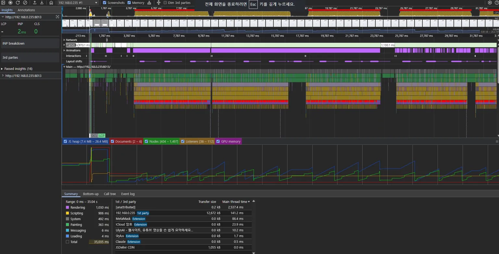
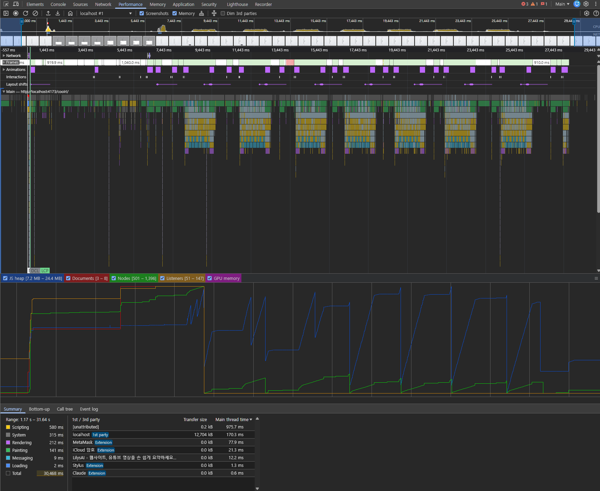

# Omok Web Client — iOS Safari Memory Investigation

This note records two separate tab-death incidents on iOS Safari while
running the 15×15 Omok ("쿨파고") web client, and the diagnostic reasoning
behind each fix. The two incidents look identical from the user's seat
("game runs for a while, tab dies") but have completely different root
causes on completely different memory axes. Keeping them separate in
memory makes future regressions easier to bisect.

Relevant commits:

- `5687c62` — Stabilize Omok web UI for iOS Safari (WASM era, compositor pressure)
- `d7fd988` — Reduce WebGPU memory pressure for iOS Safari (WebGPU era, inference pressure)
- Phase 3 — Skip idle-release on WebGPU/WebNN sessions (see below)

## Phase 1 — WASM era: WebContent/compositor GPU pressure

At the time of phase 1, the client used the ONNX Runtime Web WASM backend
exclusively. The symptom was: open the page, play a few games, reload
the tab a couple of times — then the tab would die silently on iOS Safari.
Desktop Chrome was unaffected.

### What the profile showed

The DevTools performance recording showed:

- **JS heap flat.** No MCTS tree or replay-buffer growth. The C-side MCTS
  memory incident (see `omok-mcts-memory.md`) was about the Python
  training process on the host, not the browser — the browser's MCTS
  lived in TS, allocated per search and torn down cleanly.
- **GPU memory drifted up** even though the app did no GPU compute: ORT
  was on WASM, inference ran entirely on CPU. The GPU pressure was
  coming from the **browser's own compositor**, not from inference.
- Frames showed constant re-paint activity during idle, which is the
  giveaway.

### Root cause

iOS Safari's WebContent process shares a tight memory budget (roughly
1–1.5 GB, co-occupied by the compositor). The page was hostile to that
budget in several ways that are invisible to desktop Chrome:

1. **`backdrop-filter: saturate(180%) blur(22px)`** on every glass
   surface (board card, player cards, turn pill, icon buttons, settings
   sheet). Each blur is a full-viewport offscreen pass at the device
   pixel ratio. On iPhone DPR 3 devices with a high-resolution viewport,
   this cost the compositor tens of megabytes of texture atlas per
   layer, retained across frames.
2. **A 2.05 s infinite blur-sweep animation** on `.turn-pill.thinking`,
   which kept the compositor invalidating and re-uploading textures
   every frame even when nothing else was happening.
3. **Per-frame canvas size sync** re-checked `getBoundingClientRect`
   and reassigned `canvas.width/height` whenever rounding shifted,
   forcing a reallocation of the backing store every frame.
4. **`devicePixelRatio`-unlimited canvas** on DPR 3 iPhones produced a
   9× oversized backing store for the 15×15 board, which is roughly an
   order of magnitude more pixels than the board ever needs.
5. **Debug panel polling `setInterval(render, 500 ms)`** ran whether or
   not the `
` panel was open, which did continuous layout
   reads + DOM writes in the background.
6. **Retained model `ArrayBuffer` copies** — every evaluator reload
   kept an extra copy of the ~12 MB `best.onnx` bytes in JS heap for
   "redo" convenience.

Individually, every one of these is cheap on desktop and invisible on
Android Chrome. Together, on iOS Safari, they pushed the WebContent
process's high-water mark over the limit on the second or third tab
reload — at which point Safari silently jettisons the tab.

### Fix (commit `5687c62`)

Applied defensively on mobile/iOS only, to keep desktop pristine:

- Removed all `backdrop-filter: blur(...)` (replaced with flat fill).
- Removed the blur-sweep animation (`display: none` on the pseudo).
- Capped canvas DPR to 1.5 on iOS, 2 on other mobile.
- Stopped per-frame canvas size sync; only sync on resize.
- Stopped the debug panel polling when the panel is closed.
- Refetch the default model from the browser cache on reload instead of
  retaining an ArrayBuffer copy.
- Reused the worker feature buffer across inference calls so WASM
  inference doesn't keep allocating Float32Arrays.

These mitigations survived the Svelte + Vite + TS refactor intact — see
`util/device.ts` (`canvasPixelRatio`, `isLowMemoryMode`), `omok-controller.ts`
(`applyDeviceDefaults`, `releaseEvaluatorForIdle`, `MOBILE_MCTS_MAX_CHILDREN`),
and `evaluator/worker.ts` (`featureBuffer` reuse).

## Phase 2 — WebGPU era: inference-side GPU pressure

After the ORT Web 1.24 upgrade and the addition of a user-selectable
WebGPU backend (commits `cb108eb`, `7fcdad6`, `770fd16`), a new tab-death
pattern appeared on iOS Safari — but only when the user explicitly
picked WebGPU. "Auto" already routes mobile to WASM. With WebGPU
selected, the tab would survive a few games fine and then die mid-search.

### What the profile showed

Profile taken on Windows Chrome, but the shape is what matters:

- **JS heap** stable around 7–24 MB across the whole recording. Flat-ish
  with normal GC. **Not** a JS leak.
- **GPU memory** (bottom chart, blue line) sawtoothed in lockstep with
  MCTS bursts — every search grew GPU memory, then released most of it
  before the next search. Critically, **desktop Chrome released the
  buffers before the next peak**, so the high-water mark stayed bounded.
- Main thread showed dense compute bursts separated by idle gaps, as
  expected for MCTS.

The desktop profile looked healthy. The question was why iOS died on
the same pattern.

### Root cause

Unlike phase 1, the pressure here is on the **inference side**, not the
compositor side. Three GPU-resident lifetimes contribute to the
high-water mark:

1. **Per-run input tensor.** `worker.ts` allocates
   `new ort.Tensor("float32", features, [batch, 4, N, N])` on every
   `evaluate()` call. With the WebGPU EP, creating a tensor allocates a
   GPUBuffer. The `OrtTensor` JS object holds a reference to that buffer
   until GC frees it. Desktop V8 is aggressive about GC-ing these; iOS
   Safari's JSC is much lazier, so the input buffer for last search
   often outlives the next search's allocation.

2. **Per-run output tensors.** The ORT WebGPU EP can return outputs as
   GPU-resident tensors depending on the session configuration. If the
   output stays GPU-resident, the `.data` access forces a readback, but
   the GPU copy isn't disposed until the JS `OrtTensor` object is GC'd.

3. **Session-resident state.** Model weights, intermediate activations,
   and scratch buffers live on the GPU for the session's lifetime.
   Nothing the app can do short of terminating the session.

iOS Safari amplifies all three vs. desktop Chrome:

- iOS WebGPU is only available on 17.4+ and its buffer reclamation is
  slower and less eager than Chrome's WebGPU implementation. Buffers
  hang around longer even after their JS owner is unreachable.
- The WebContent process memory budget is the same tight 1–1.5 GB as
  phase 1, now shared with the actual WebGPU allocations.
- Several searches worth of per-run buffers can coexist in GPU memory
  before GC fires, and the cumulative allocation crosses the budget.
  WebContent gets jettisoned. Tab dies.

### Fix (commit `d7fd988`)

Three changes, each attacking one of the three lifetimes above:

1. **Dispose input + output tensors on every `run()`.** `evaluate()` and
   `warmUp()` now wrap the call in a `try/finally` and call
   `tensor.dispose?.()` on the input plus every returned output tensor.
   On WASM `dispose` is effectively a no-op, so desktop and non-iOS
   behavior is unchanged. On WebGPU it releases GPU buffers
   deterministically instead of waiting on GC.

2. **`preferredOutputLocation: "cpu"` for WebGPU/WebNN sessions.** Tells
   ORT to copy outputs back to CPU memory before `run()` resolves, so
   the GPU-side output buffer is eligible for reuse/release
   immediately. Combined with the output dispose above, this pins the
   output lifetime to a single `run()`.

3. **Disable WebGPU/WebNN select options on mobile.** `auto` already
   keeps mobile on WASM (`resolveBackendAttempts(choice, gpu, isMobile)`),
   but an explicit selection was still clickable. The options are now
   `disabled` and labeled "(모바일 불안정)" on mobile. Visible (for
   transparency) but un-selectable (to protect users from the unstable
   path).

Session-resident state (item 3 in the cause list) isn't addressed here
because nothing at the app layer can. The existing idle-release path
(`releaseEvaluatorForIdle` → `terminateEvaluator` on mobile) already
handles this by terminating the worker when the user's turn is
prolonged or the game ends — but see phase 3 below for why that help
turns into harm on GPU backends.

## Phase 3 — WebGPU era, revisited: idle-release churn

After the phase 2 mitigations shipped, users on iOS Safari who
explicitly selected WebGPU still reported a mid-game failure: some
number of searches in, a red "모델 로드 실패"-class chip would appear
and the tab would die a few seconds later. The pattern was distinct
from phase 2 (which was a smooth cumulative death); this one hit a
sharp cliff.

### Root cause

The phase 1 idle-release (`releaseEvaluatorForIdle` → `terminateEvaluator`
on mobile, 400 ms after every AI move ends) was designed around WASM.
Its goal was to drop retained Float32Array buffers and the worker's JS
heap while the user thinks. Harmless for WASM, but **actively harmful
for WebGPU**:

1. Every AI turn ends with `scheduleEvaluatorIdleRelease()` queuing a
   400 ms timer. On mobile the timer fires `worker.terminate()` — a
   hard kill with no `session.release()` call, so ORT's GPU resource
   cleanup falls on the driver's lazy GC path (slow on iOS Safari).
2. On the human's next move → AI turn → `ensureEvaluatorReady`
   rebuilds the worker from scratch. That means:
   - Refetching the 12 MB default model via `force-cache` (which can
     miss under iOS memory pressure, producing a "로드 실패" chip from
     `fetchBufferFor`).
   - Re-creating the WebGPU device and reuploading all model weights
     to new GPUBuffers.
   - Recompiling every operator's compute shader pipeline.
3. Brief window where the old session's GPU state hasn't finalized and
   the new session's is already allocated — **peak GPU footprint
   roughly doubles** for ~100 ms per turn.
4. Repeat 20+ times per game. iOS Safari's WebContent process loses
   the race somewhere between turn 5 and turn 20.

The chip ("WebGPU 준비 실패", "로드 실패 [...]" — phrasing varies with
where in the reinit pipeline the failure lands) is only the first
visible symptom. The tab death that follows is the WebContent process
being jettisoned by the OS a few seconds later, once memory pressure
is already past the limit.

### Fix

- `releaseEvaluatorForIdle` now **early-returns on WebGPU/WebNN
  sessions**. WASM idle release still runs — that path is still net
  positive. For GPU sessions the evaluator is kept alive across turns,
  so the per-turn churn goes away and iOS only has to survive **one**
  session lifetime, not twenty. Session-resident state doesn't grow
  across turns (phase 2 dispose hooks handle that), so keeping the
  session alive has a bounded footprint.

- Error chips now append the first ~50 chars of the underlying error
  (helper `errorChipDetail`), so future iOS incidents leave a crumb
  trail instead of a generic "WebGPU 준비 실패" that hides the actual
  failure mode.

### Residual: clean session teardown

When the user manually changes the backend (or picks a new ONNX file),
we still call `worker.terminate()` without a preceding
`session.release()`. That's acceptable because those are rare
user-initiated events, not per-turn, but the cleanest fix would be a
new `dispose` message on the worker protocol that awaits
`InferenceSession.release()` before the worker exits. Filed as a
follow-up.

## Layered mitigations — what is active where

| Category | Desktop | Mobile (non-iOS) | iOS Safari |
|---|---|---|---|
| backdrop-filter/blur | enabled | disabled (`ios-low-memory` class does not match) | **disabled** |
| Canvas DPR cap | uncapped | ≤ 2 | **≤ 1.5** |
| Debug panel polling | on only while `
` open | same | same |
| MCTS `maxChildren` | Infinity | **48** | **48** |
| Auto backend | WebGPU → WASM fallback | **WASM only** | **WASM only** |
| WebGPU/WebNN option clickable | yes | **no** | **no** |
| Tensor dispose on run | yes (no-op on WASM) | yes | yes |
| preferredOutputLocation=cpu | WebGPU/WebNN only | n/a (WASM) | n/a (WASM) |
| Evaluator idle release (WASM session) | off | on | on |
| Evaluator idle release (WebGPU/WebNN session) | off | **off** | **off** |
| Error chip includes exception detail | yes | yes | yes |

## Residual risks / open items

- **ORT Web version drift.** The worker loads
  `https://cdn.jsdelivr.net/npm/onnxruntime-web@1.24.3/dist/ort.webgpu.min.js`
  via `importScripts` from jsdelivr. Pinned URL so no silent content
  drift, but on a version bump the loader's expected wasm-glue
  filename can shift (`.jsep.*` → `.asyncify.*` happened across 1.23 →
  1.24 — see commits `cb108eb` / `770fd16`). We mitigate by setting
  `ort.env.wasm.wasmPaths = ORT_CDN_BASE` (base URL only) so the loader
  picks its own filename. If this class of bug recurs, consider
  switching `onnxruntime-web` to a `package.json` dependency and
  bundling the ESM entry (`onnxruntime-web/webgpu` →
  `ort.webgpu.bundle.min.mjs`) while keeping the wasm binary on CDN.

- **iOS desktop-class iPads.** The `isIos` check keys off UA and
  `MacIntel + maxTouchPoints > 1`. Works today but Safari's UA on iPadOS
  is unstable.

- **WebGPU on mobile Chrome (Android).** Currently disabled by the
  mobile guard. When Android WebGPU is proven out this can be revisited
  — the guard is by `isMobileDevice`, not `isIos`, so it's coarser than
  necessary today.

- **Session lifetime on desktop.** Desktop does not currently call
  `releaseEvaluatorForIdle`, so model weights stay GPU-resident between
  games. Acceptable on a laptop, potentially a concern on battery.
