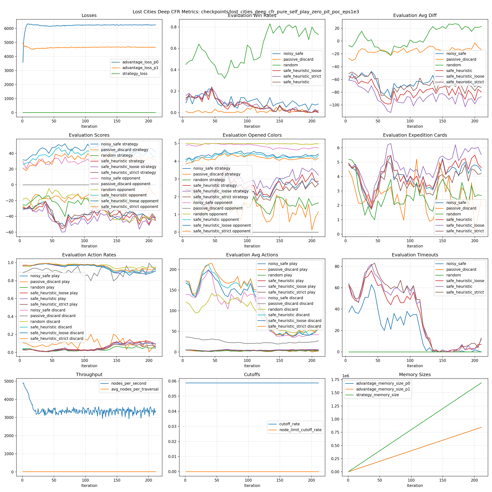

# Lost Cities Deep CFR Pure Self-Play Zero-Pit PoC eps1e3

이 폴더가 `lost_cities_deep_cfr_pure_self_play_zero_pit_poc_eps1e3` 실험의 canonical 위치다. 기존 루트 `configs/*.yaml` 경로는 이 실험에 대해 유지하지 않는다.

## 목적

random init pure self-play에서 `regret_matching_epsilon`을 `1.0e-3`으로 키우면 discard/draw-pile 쪽으로 조기 붕괴하는 zero-pit 경향이 줄어드는지 확인한다.

## 기준 실험과 차이

기준은 기존 Run A다.

```text
configs/lost_cities_deep_cfr_pure_self_play_a.yaml
```

의도한 차이는 `regret_matching_epsilon` 하나다.

```yaml
regret_matching_epsilon: 1.0e-8  # Run A
regret_matching_epsilon: 1.0e-3  # 이 PoC
```

seed, network, traversal budget, self-play league, evaluation opponent, memory, optimization은 Run A와 동일하게 둔다.

## 실행

```bash
uv run python -m coolrl.lost_cities.deep_cfr.cli train \
  --config experiments/lost_cities/deep_cfr_pure_self_play_zero_pit_poc_eps1e3/config.yaml
```

상태 확인:

```bash
uv run python -m coolrl.lost_cities.deep_cfr.cli status \
  --checkpoint-dir checkpoints/lost_cities_deep_cfr_pure_self_play_zero_pit_poc_eps1e3
```

plot 생성:

```bash
uv run python -m coolrl.lost_cities.deep_cfr.cli plot \
  --checkpoint-dir checkpoints/lost_cities_deep_cfr_pure_self_play_zero_pit_poc_eps1e3
```

분석 요약:

```bash
uv run python experiments/lost_cities/deep_cfr_pure_self_play_zero_pit_poc_eps1e3/analyze.py \
  --run checkpoints/lost_cities_deep_cfr_pure_self_play_zero_pit_poc_eps1e3 \
  --json-output experiments/lost_cities/deep_cfr_pure_self_play_zero_pit_poc_eps1e3/zero_pit_summary.json \
  --markdown-output experiments/lost_cities/deep_cfr_pure_self_play_zero_pit_poc_eps1e3/zero_pit_summary.md
```

Run A checkpoint가 로컬에 있으면 `--baseline-run checkpoints/lost_cities_deep_cfr_pure_self_play_a_2h_official`을 추가해 baseline delta를 함께 생성한다.

## 주요 지표

win rate보다 먼저 행동 분포를 본다.

- `play_action_rate`
- `discard_action_rate`
- `draw_deck_rate`
- `draw_pile_rate`
- `eval_*_avg_opened_colors`
- `eval_*_avg_expedition_cards`
- `eval_safe_heuristic_avg_diff`
- `eval_safe_heuristic_win_rate`
- `eval_*_max_step_timeouts`

## 결과 위치

실행 결과는 `checkpoints/lost_cities_deep_cfr_pure_self_play_zero_pit_poc_eps1e3/` 아래에 저장한다.

## 결과

이 실험은 iteration 211에서 중지했다. 총 학습 시간은 약 60.6분이다.



상세 요약:

- [zero_pit_summary.md](zero_pit_summary.md)
- [zero_pit_summary.json](zero_pit_summary.json)

첨부된 요약은 생성 시점에 Run A 2h official checkpoint를 baseline으로 사용했다.

최신 eval 기준 핵심 결과:

| opponent | win_rate | avg_diff | play_action_rate | discard_action_rate | avg_opened_colors | max_step_timeouts |
| --- | --- | --- | --- | --- | --- | --- |
| random | 0.73 | 22.69 | 0.0476 | 0.9524 | 1.65 | 0 |
| passive_discard | 0.02 | -13.44 | 0.0776 | 0.9224 | 1.15 | 0 |
| safe_heuristic | 0.00 | -79.72 | 0.0669 | 0.9331 | 2.87 | 12 |
| safe_heuristic_loose | 0.00 | -87.04 | 0.0913 | 0.9087 | 3.21 | 7 |
| safe_heuristic_strict | 0.01 | -72.62 | 0.0556 | 0.9444 | 2.72 | 13 |

판정:

- `regret_matching_epsilon=1.0e-3`은 zero-pit 완화에는 효과가 있었다. safe 계열 timeout이 크게 줄었고, baseline 대비 play 비율과 opened colors가 증가했다.
- 그러나 safe 계열 상대 성능은 개선되지 않았다. `safe_heuristic` 평균 점수차는 -79.72이고, loose/strict 계열도 큰 음수에 머물렀다.
- 이 run은 진단 실험으로 종료한다. 후속 실험은 `regret_matching_epsilon=1.0e-4` 또는 `3.0e-4` static run, 혹은 초반 `1.0e-3` 후 낮추는 schedule을 우선 검토한다.

## 관련 문서

해석 노트와 판정 기준은 `docs/lost-cities-zero-pit-poc/README.md`에 둔다.
